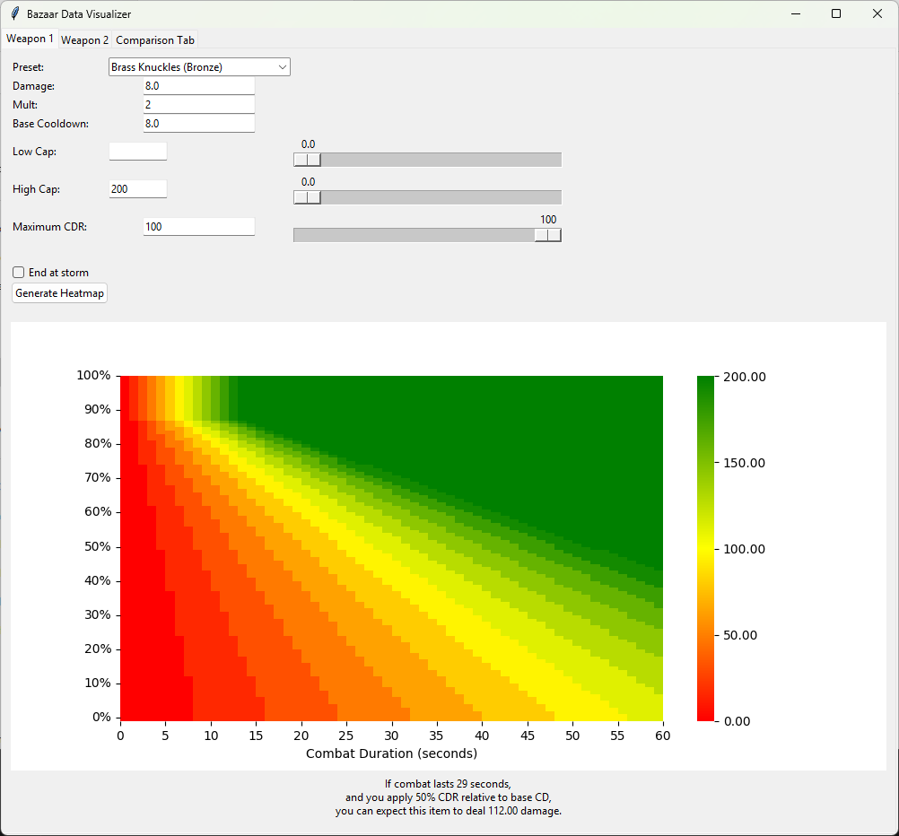

# Bazaar Data Visualizer



## Description

A simple GUI tool that allows you to visualize and compare the expected output of two items for a given combat duration and percentage of cooldown reduction applied.

Currently, it only functions for basic damage, heal, and shield items (while the app uses the terms "weapon" and "damage" exclusively, the numbers would be identical for heal and shield items as well.) I intend to add more features, including poison and fire calculations, accounting for item size, and to allow the user to map other variables to the y axis instead of cooldown reduction (e.g expected haste uptime, crit chance, etc.).

## User Guide

How should you use this tool? That's entirely up to you. It's faily limited in its current state, and The Bazaar is a very complex game with lots of edge cases and complicating factors. It never hurts to have more information though, and messing around with seeing how different values generate different heatmaps might help develop your intuition for how a given item will perform.

Right now, I think it's best suited to helping make decisions on Day 1 and Day 2, when you may realistically be deciding between which of a few mediocre weapons are worth keeping on your board, and there are likely to be minimal complicating factors (haste, slow, skills, synergies, etc.)

Here's an example: it's Day 1, and you purchased Brass Knuckles at your first store and recieved a fang from combat. You hit up Curio and pick up some lifting gloves, buffing your Fang and Knuckles to a base damage of 8 and 11 respectively. The Fang now has an expected 2.66 DPS, while the Knuckles has an expected 2.75 DPS. What does your intuition tell you about which will perform better in combat?


In the above heatmap, green represents the % by which the Fang is expected to outperform the Knuckles, while red represents the inverse. Despite the Knuckles having a higher DPS, the heatmap is almost entirely green and yellow, meaning the Fang will outperform in nearly all scenarios.

## Documentation

### Tabs One and Two

The first two tabs allow you to generate a heatmap of expected damage output for a particular item. When you hover over a square on the heatmap, it will tell you the expected output for that specific intersection of combat duration and CDR.

**Damage**: Self explanatory. The base value on the item. Could be heal or shield as well.
**Mult**: Multiplier to base damage (either from multicast or obsidian)
**Base Cooldown**: Item's cooldown without applying CDR.

**Low Cap**: This pegs the low end of the colormap to whatever value is entered. Leave blank for automatic fit.
**High Cap**: This pegs the high end of the colormap to whatever value is entered. Leave blank for automatic fit.

>[!TIP]
>The above two settings are only visual, they don't change any values within, or the actual range of, the heatmap. You most likely want to leave them blank. There are two main reasons you would want to adjust these values: 
>1. You want to normalize the colormap so you can visually compare the charts of two items more easily, in which case you should make sure these >values are equal for both items
>2. Your weapon scales exponentially and you've lost detail in important parts of your heatmap (i.e if the very upper right corner is green but the rest of the heatmap is uniform red, you may want to set High Cap to a more sensible number.) 

**Maximum CDR**: This scales the range of values on the y-axis, with 10 being the minimum. Setting it to 100 will give you a prettier chart, but you should probably set it much lower, within the range of CDR you expect is possible for your situation.

**End at storm**: By default, the x-axis has a range of 60 seconds. If this box is checked, it will truncate the range of the x-axis to 30 seconds.

>[!WARNING]
>"Maximum CDR" and "End at storm" affect the actual dimensions of the generated heatmap. If you want to generate a comparison heatmap for two items, you must ensure that these values are consistent across both of them such that their dimensions are the same.

### Comparison Tab

**Absolute Damage**: By default, the comparison table is calculated using the relative improvement one item represents over the other (i.e weapon 1 is 10% stronger than weapon 2). If you check this box, it will instead be generated using the raw damage numbers (i.e weapon 1 will deal 10 more damage than weapon 2.)

### Installation Instructions

For anyone not familiar with Python and the command line, I've built a single-click executable version of this script that includes all the necessary dependancies. You can find it on the "releases" page in the top right.

Those who already use Python and don't want to download redundant libraries all probably know what they're doing already, but to be thorough, all requirements are listed in requirements.txt, and can be installed using the command:

```bash
pip install -r requirements.txt
```

### Disclaimer

I am learning as I go. There are likely many very stupid bugs. If you encounter any and would like to report it, I would greatly appreciate it.